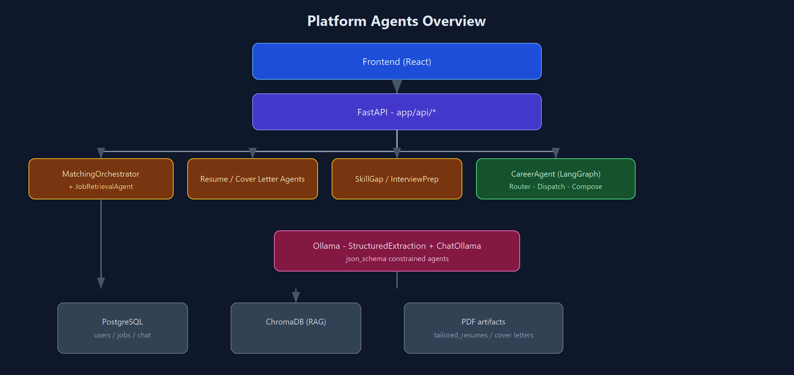
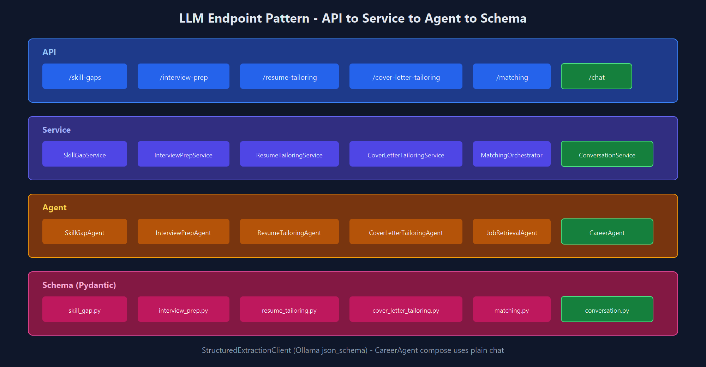
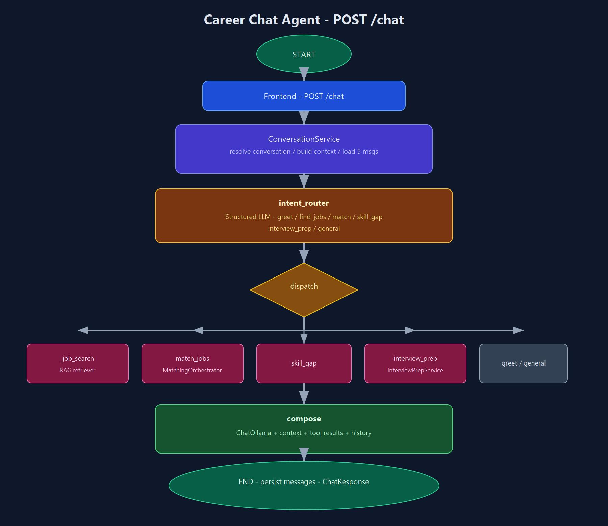

# AI Internship Agent

AI-powered internship matching platform. Users sign up, upload a resume, and get
matched against scraped internship listings using a RAG pipeline. They can tailor
a resume or cover letter toward a job, analyze skill gaps, prepare for interviews,
track applications, and chat with a conversational career assistant.

## Project structure

### Backend (`app/`)

```text
AI Internship Agent/
├── app/
│   ├── main.py                         # FastAPI entry point, CORS, router wiring
│   ├── api/
│   │   ├── auth.py                     # Signup, login, logout, refresh, /me
│   │   ├── jobs.py                     # Scrape + list jobs
│   │   ├── matching.py                 # RAG internship matching
│   │   ├── user_details.py             # Resume/cover-letter parse, profile summary
│   │   ├── resume_tailoring.py         # Resume → PDF tailoring
│   │   ├── cover_letter_tailoring.py   # Cover letter → PDF tailoring
│   │   ├── skill_gaps.py               # Skill-gap analysis JSON
│   │   ├── interview_prep.py           # Interview prep JSON
│   │   ├── conversations.py            # POST /chat (career chatbot)
│   │   └── dependencies.py             # DI providers for services/agents
│   ├── auth/                           # JWT, cookies, password, get_current_user
│   ├── agents/
│   │   ├── orchestrator.py             # Matching orchestrator (profile + RAG)
│   │   ├── job_retrieval_agent.py      # Job retrieval for matching
│   │   ├── resume_agent.py             # Resume parsing (structured extraction)
│   │   ├── cover_letter_agent.py       # Cover letter parsing
│   │   ├── resume_tailoring_agent.py   # LLM resume section rewrite
│   │   ├── cover_letter_tailoring_agent.py
│   │   ├── skill_gap_agent.py
│   │   ├── interview_prep_agent.py
│   │   ├── career_agent.py             # LangGraph chat agent (router → dispatch → compose)
│   │   └── career_tools.py             # Chat tools wrapping existing services
│   ├── services/
│   │   ├── job_scrape_service.py       # Scraper → Postgres + RAG
│   │   ├── user_detail_service.py      # Parse/list resumes and cover letters
│   │   ├── profile_service.py          # Profile summary
│   │   ├── resume_tailoring_service.py # LLM → Jinja LaTeX → pdflatex
│   │   ├── cover_letter_tailoring_service.py
│   │   ├── skill_gap_service.py
│   │   ├── interview_prep_service.py
│   │   ├── conversation_service.py     # Chat turn orchestration + persistence
│   │   └── career_context_service.py   # Build candidate context for chat
│   ├── templates/
│   │   ├── resume/resume_template.tex.j2
│   │   └── cover_letter/cover_letter_template.tex.j2
│   ├── database/
│   │   ├── connection.py
│   │   └── repositories/               # User, Job, UserDetail, Conversation, …
│   ├── models/                         # SQLAlchemy ORM (User, Job, Conversation, …)
│   ├── schemas/                        # Pydantic API/LLM contracts
│   ├── rag/                            # Embeddings, Chroma, ingestion, retrieval
│   ├── scraper/mocker_scraper.py       # Mock internship data source
│   ├── llm/client.py                   # StructuredExtractionClient (Ollama)
│   ├── utils/                          # LaTeX escape, resume section split, files
│   └── core/                           # Settings, domain exceptions
├── migrations/versions/
│   ├── 20260730_0001_initial_schema.py
│   ├── 20260805_0002_create_jobs_table.py
│   ├── 20260808_0003_add_resume_linkedin.py
│   ├── 20260808_0004_add_resume_headline.py
│   └── 20260815_0005_create_conversations.py
├── tailored_resumes/                   # Generated resume JSON/TeX/PDF (not in Postgres)
├── tailored_cover_letters/
├── tests/
├── docs/
│   └── diagrams/                       # draw.io agent flow diagrams (+ SVG previews)
├── docker-compose.yml                  # Chroma HTTP server
├── .env.example
├── alembic.ini
├── pyproject.toml
└── README.md
```

### Frontend (`frontend/`)

React + TypeScript + Vite + Tailwind. Cookie-based auth against the FastAPI backend.

```text
frontend/
├── src/
│   ├── main.tsx                        # React entry
│   ├── App.tsx                         # Routes + auth gate
│   ├── index.css                       # Tailwind globals
│   ├── api/
│   │   └── client.ts                   # Axios instance (withCredentials)
│   ├── store/
│   │   ├── authStore.ts                # Login/signup/session
│   │   ├── jobStore.ts                 # Jobs list, scrape, selected job
│   │   ├── documentStore.ts            # Parsed resumes & cover letters
│   │   └── applicationStore.ts         # Application tracker (localStorage)
│   ├── components/layout/
│   │   ├── Layout.tsx                  # Sidebar + header shell
│   │   ├── Sidebar.tsx                 # Navigation
│   │   └── Header.tsx                  # Search bar, profile summary modal
│   ├── pages/
│   │   ├── SignIn.tsx / SignUp.tsx
│   │   ├── Dashboard.tsx               # Upload resume, parsed list, matching
│   │   ├── Jobs.tsx                    # Job board, AI actions, Apply → tracker
│   │   ├── Applications.tsx            # Application tracking (static seed + Apply)
│   │   ├── ResumeBuilder.tsx           # Tailored resume PDF + preview
│   │   ├── CoverLetter.tsx             # Tailored cover letter PDF + preview
│   │   ├── Skills.tsx                  # Skill-gap analysis
│   │   ├── InterviewPrep.tsx           # Interview prep plan
│   │   └── Chat.tsx                    # Career Chat → POST /chat
│   └── lib/constants.ts
├── .env.example                        # VITE_API_URL=http://localhost:8000
├── vite.config.ts                      # Dev server port 5173
├── tailwind.config.js
├── package.json
└── index.html
```

## Authentication policy

JWT access and refresh tokens are stored in **HTTP-only cookies**.

| Kind | Endpoints |
| --- | --- |
| Public | `GET /health`, `POST /auth/signup`, `POST /auth/login`, `POST /auth/refresh`, `POST /auth/logout`, `/docs` |
| Protected | every other business endpoint (requires a valid access-token cookie) |

New endpoints must use `get_current_user` (router-level dependency preferred).
Clients do **not** send a `user_id`; ownership comes from the verified cookie.

## API overview

### Auth

| Method | Path | Auth |
| --- | --- | --- |
| `POST` | `/auth/signup` | No |
| `POST` | `/auth/login` | No |
| `POST` | `/auth/refresh` | Refresh cookie |
| `POST` | `/auth/logout` | No |
| `GET` | `/auth/me` | Access cookie |

### Jobs (scrape + list)

| Method | Path | Auth | Notes |
| --- | --- | --- | --- |
| `POST` | `/jobs/scrape?reset_vectors=true` | Required | Mock scraper → Postgres + RAG/Chroma |
| `GET` | `/jobs` | Required | Lists jobs from PostgreSQL |

### User documents

| Method | Path | Auth |
| --- | --- | --- |
| `POST` | `/resumes/parse` | Required |
| `GET` | `/resumes` | Required |
| `POST` | `/cover-letters/parse` | Required |
| `GET` | `/cover-letters` | Required |
| `POST` | `/profile-summary` | Required |

### Matching

| Method | Path | Auth | Notes |
| --- | --- | --- | --- |
| `POST` | `/matching` | Required | Multipart: `user_detail_id` **or** PDF/DOCX `file`, not both |

### Resume / cover letter tailoring

| Method | Path | Auth | Notes |
| --- | --- | --- | --- |
| `POST` | `/resume-tailoring` | Required | Multipart: `instructions` + `file` or `user_detail_id`; optional `job_id`. Returns PDF |
| `POST` | `/cover-letter-tailoring` | Required | Same multipart pattern. Returns PDF |

Requires local TeX (`pdflatex`). Artifacts under `TAILORED_*_DIR/<user_id>/<id>/`.

### Skill gaps & interview prep

| Method | Path | Auth | Notes |
| --- | --- | --- | --- |
| `POST` | `/skill-gaps` | Required | Multipart: required `job_id` + resume source. Returns JSON |
| `POST` | `/interview-prep` | Required | JSON: optional `job_id`, `instructions`. Returns JSON |

### Career chat

| Method | Path | Auth | Notes |
| --- | --- | --- | --- |
| `POST` | `/chat` | Required | JSON: `message`, optional `conversation_id`. Returns reply + intent |

Interactive docs: [http://127.0.0.1:8000/docs](http://127.0.0.1:8000/docs)

## Agent flow diagrams (draw.io)

Visual architecture for all agents. **Editable sources** live in [`docs/diagrams/`](docs/diagrams/) (open `.drawio` files in [diagrams.net](https://app.diagrams.net)). PNG previews below render on GitHub and in most Markdown viewers.

### 1. Platform agents overview

High-level map: frontend → FastAPI → agents → Ollama → Postgres / Chroma / PDF artifacts.



[Edit in draw.io](docs/diagrams/platform-agents-overview.drawio) · [SVG](docs/diagrams/platform-agents-overview.svg)

### 2. LLM endpoint pattern (4 layers)

Every JSON/PDF agent endpoint follows **API → Service → Agent → Schema**. Chat uses the same service layer with a LangGraph agent.



[Edit in draw.io](docs/diagrams/llm-endpoint-pipeline.drawio) · [SVG](docs/diagrams/llm-endpoint-pipeline.svg)

| Endpoint | Agent | Output |
| --- | --- | --- |
| `POST /matching` | `JobRetrievalAgent` via `MatchingOrchestrator` | Ranked job matches |
| `POST /skill-gaps` | `SkillGapAgent` | Readiness + gaps JSON |
| `POST /interview-prep` | `InterviewPrepAgent` | Prep plan JSON |
| `POST /resume-tailoring` | `ResumeTailoringAgent` | PDF (+ LaTeX/JSON artifacts) |
| `POST /cover-letter-tailoring` | `CoverLetterTailoringAgent` | PDF |
| `POST /chat` | `CareerAgent` (LangGraph) | Natural-language reply |

### 3. Career Chat agent (LangGraph)

Conversational agent exposed as `POST /chat` and the frontend **Career Chat** page.



[Edit in draw.io](docs/diagrams/career-chat-agent.drawio) · [SVG](docs/diagrams/career-chat-agent.svg)

**Graph nodes** (`app/agents/career_agent.py`):

1. **intent_router** — structured LLM → `IntentDecision` (`greet`, `find_jobs`, `match`, `skill_gap`, `interview_prep`, `general`)
2. **dispatch** — routes to `CareerTools` (no LLM)
3. **compose** — plain `ChatOllama` reply using context + tool JSON + history

**Before the graph**, `ConversationService` resolves/creates the conversation, builds candidate context, and loads the last **5** messages from Postgres.

**After the graph**, user + assistant messages are persisted; response includes `conversation_id`, `reply`, `intent`, and optional `tool_used`.

### Supported chat intents

| Intent | When | Tool / backend |
| --- | --- | --- |
| `greet` | Hi / start of chat | None — compose greets by name |
| `find_jobs` | “Find Python internships in Hyderabad” | `job_search` → RAG retriever |
| `match` | “Which jobs fit my resume?” | `match_jobs` → matching orchestrator (needs parsed resume) |
| `skill_gap` | “What skills am I missing for job X?” | `skill_gap` → skill-gap service (needs `job_id` + resume) |
| `interview_prep` | “Help me prepare for this interview” | `interview_prep` → interview-prep service |
| `general` | Other career/platform questions | None — compose only |

Tool failures (e.g. no resume uploaded) return soft errors in `ToolResult`; the compose node tells the user what to do next.

### Chat persistence

- Tables: `conversations`, `chat_messages` (migration `20260815_0005_create_conversations.py`)
- Frontend sends `conversation_id` from the previous response to continue a thread

## Setup

### Backend dependencies

```powershell
uv sync
copy .env.example .env
```

Edit `.env` with your PostgreSQL password, secrets, and Ollama settings.

### PostgreSQL

```powershell
uv run alembic upgrade head
```

If the database was created earlier via app startup `create_all`:

```powershell
uv run alembic stamp head
```

### ChromaDB (vector store)

```powershell
docker compose up -d
curl http://localhost:6333/api/v2/heartbeat
```

```ini
CHROMA_MODE=http
CHROMA_HOST=localhost
CHROMA_PORT=6333
```

### Ollama

```powershell
ollama pull mxbai-embed-large
ollama pull granite4.1:8b
```

Default chat model in config is `gpt-oss:120b-cloud` (see `app/core/config.py`).

### LaTeX (PDF output)

Install MiKTeX or TeX Live. Set in `.env` if `pdflatex` is not on `PATH`:

```ini
LATEX_COMPILER_PATH=pdflatex
TAILORED_RESUME_DIR=tailored_resumes
TAILORED_COVER_LETTER_DIR=tailored_cover_letters
```

### Frontend dependencies

```powershell
cd frontend
copy .env.example .env
npm install
```

## Run the application

Run **both** the backend and frontend in separate terminals.

### Terminal 1 — Backend (FastAPI)

From the repository root:

```powershell
uv run python -m uvicorn app.main:app --reload
```

- API: [http://127.0.0.1:8000](http://127.0.0.1:8000)
- Swagger: [http://127.0.0.1:8000/docs](http://127.0.0.1:8000/docs)

### Terminal 2 — Frontend (Vite + React)

```powershell
cd frontend
npm run dev
```

- UI: [http://127.0.0.1:5173](http://127.0.0.1:5173)
- Ensure `frontend/.env` has `VITE_API_URL=http://localhost:8000`

### Production build (frontend only)

```powershell
cd frontend
npm run build
npm run preview
```

## Typical user flow

**Via UI (recommended)**

1. Sign up / sign in at `/signin`
2. **Dashboard** — upload and parse a resume
3. **Jobs** — scan platforms, browse listings, **Apply** (adds to Application Tracker)
4. **Applications** — track status and deadlines
5. **Resumes** / **Cover Letters** — tailor PDFs for a selected job
6. **Skill Gaps** / **Interview Prep** — analyze fit and prepare
7. **Career Chat** — natural-language assistant (`POST /chat`)
8. Header profile icon — `POST /profile-summary` modal

**Via `/docs` (API)**

1. `POST /auth/signup` or `POST /auth/login`
2. `POST /jobs/scrape` → `GET /jobs`
3. `POST /resumes/parse` → `POST /matching`
4. `POST /resume-tailoring` / `POST /cover-letter-tailoring` (PDF)
5. `POST /skill-gaps` / `POST /interview-prep` (JSON)
6. `POST /chat` with `{ "message": "Find me Python internships" }`

## Run the tests

```powershell
uv run pytest
```

Single file examples:

```powershell
uv run pytest tests/api/test_conversations.py -v
uv run pytest tests/agents/test_career_agent.py -v
```

Lint (backend):

```powershell
.venv\Scripts\ruff.exe check app/ tests/
```
